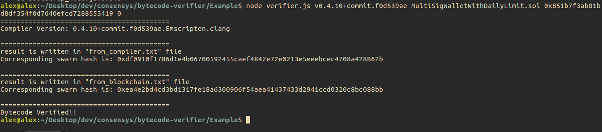

# Gnosis Auction Contract Verification

The following process describes the steps to be automated by the verifier tool:

1. Create and enter a new folder named "test_bytecode" or whatever you prefer. `mkdir test_bytecode && cd test_bytecode`. 
Then initiate npm for a local dependency list. `npm init` (for simplicity, you could skip most of the specification e.g. 'author','licence','description'etc.)

2. Copy code from [etherscan](https://etherscan.io/address/0x851b7f3ab81bd8df354f0d7640efcd7288553419#code "Gnosis Auction contract code"), and paste into a empty file. Name the file `MultiSigWalletWithDailyLimit.sol` (Attention: the file name has to follow the contract name, case-sensitive, with a `.sol` file extension!)

3. Install a specified solidity compiler version at your choice using npm. In our case, we will choose to use `v0.4.10+commit.f0d539ae` , 
Go to `node_modules/solc/` folder, type in command 

```shell
mkdir bin
wget https://raw.githubusercontent.com/ethereum/solc-bin/gh-pages/bin/soljson-v0.4.10%2Bcommit.f0d539ae.js ./node_modules/solc/bin/
```

Now, you have the specific compiler ready.

4. Time for the truth. Go to folder `bytecode-verifier/Example`folder, type in the following command in your terminal:

```shell
node verifier.js v0.4.10+commit.f0d539ae MultiSigWalletWithDailyLimit.sol 0x851b7f3ab81bd8df354f0d7640efcd7288553419 0
```

To clarify, here is what all those parameters being passed:
|Parameter  |Content           |
|-----------|:----------------:|
|First      |Compiler Version  |  
|Second     |File Name         |
|Third      |Contract Address  |
|Fourth     |Optimizer (0 or 1)|

So what we mean by passing the four parameters is that we want to compare the bytecode of the contract on blockchain at `0x851b7f3ab81bd8df354f0d7640efcd7288553419` with our locally compiled bytecode with a choice of compiler version `v0.4.10+commit.f0d539ae` and optimizer disabled. 

if everything goes correctly, what you will get is the following:


Additionally, you could see the individual actually deployed bytecode in 'from_blockchain.txt' and 'from_compiler.txt'. Of course, actual Javascript code can be found at 'verifier.js'

Cheers!