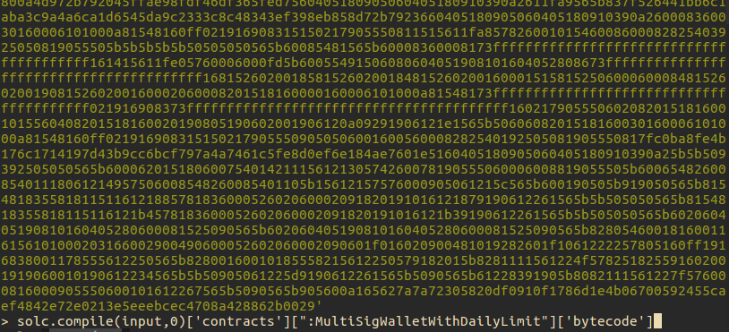
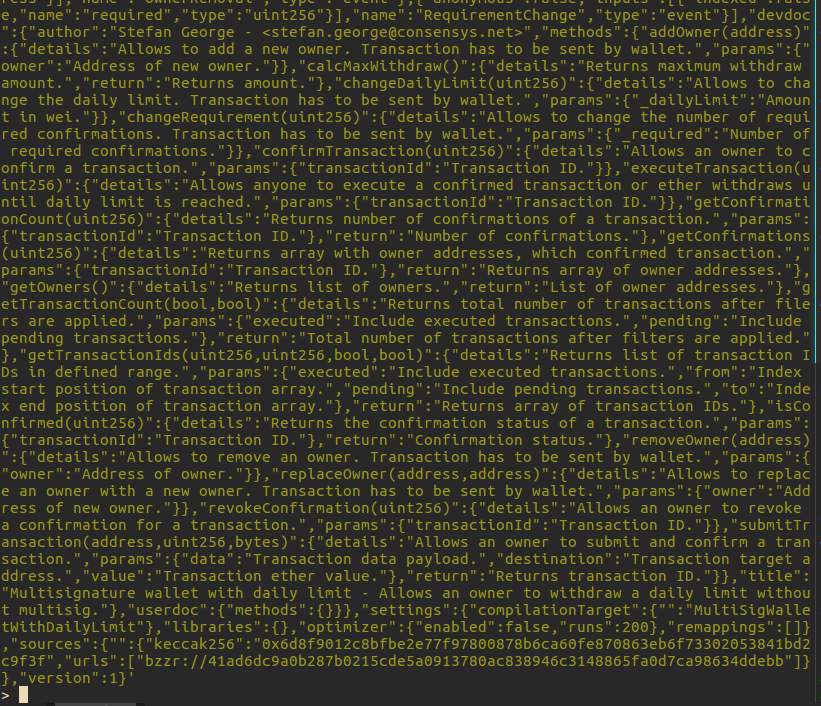

# Gnosis Auction Contract Verification

The following process describes the steps to be automated by the verifier tool:

1. Create and enter a new folder named "test_bytecode" or whatever you prefer. 

```
mkdir test_bytecode && cd test_bytecode
``` 
Then initiate npm for a local dependency list. 
```shell
npm init
``` 
(for simplicity, you could skip most of the specification e.g. 'author','licence','description'etc.)

2. Copy code from [etherscan](https://etherscan.io/address/0x851b7f3ab81bd8df354f0d7640efcd7288553419#code "Gnosis Auction contract code"), and paste into a empty file. Name the file `GnosisAuction.sol` or whatever filename you prefer, as long as having a `.sol` file extension. 

3. Install a specified solidity compiler version at your choice using npm. In our case, we will choose to use `v0.4.10+commit.f0d539ae` , type in command: (By the time of writing, without specifying the version, `npm install solc` will download v0.4.16 compiler).
```
npm install solc@v0.4.10+commit.f0d539ae --save
```

To make sure you got the right version, two ways to verify. 
One: go to `./package.json`, you should be able to see `"dependencies": {"solc": "^0.4.10"}` in your dependency list. 
Two: go to node console by typing `node`, then enter the following:

```javascript
var solc = require('solc')
solc.version()
```
you should also be able to see the result `'0.4.16+commit.d7661dd9.Emscripten.clang'`

*The reason why `solc.useVersion('v0.4.10+commit.f0d539ae')` is not used, which seems much easier, is that when you type in command `npm install solc@certain_version`, according `soljson-certain_version.js`are not added to `./bin/`, so the module won't be found.*

Another point to keep in mind is that, every time you try to switch to another version, install that version with `--save` to replace the current dependency entry. Then close node console(if any), and open a new one, and re-require. 

4. Compile the code, enter the node console (command: `node`)

```javascript
var solc = require('solc');
var fs = require('fs');
var input = fs.readFileSync('absolute_path_to_folder/GnosisAuction.sol','utf8');
solc.compile(input,0);
```
Note: the second parameter `0` is to disable optimizer. 

By now, the compiled result is a hug HUG HUGGG JSON style object. In order to read any information without painfully scroll through the tiny screen. Please find out the output format at [Solidity Doc](https://solidity.readthedocs.io/en/develop/using-the-compiler.html)

For our purpose, all we need is the bytecode, therefore type in the following:
```javascript
solc.compile(input)['contracts'][':MultiSigWalletWithDailyLimit']['bytecode']
```
Of course, in other cases `:contractName`depends on the actual contract name being compiled.

In our case, if nothing goes wrong, the node console should give you a string starting with `606060405234156200000d5...` and ends with `08a428862b0029`. 



5. Now, it's time to testify the actual bytecode on the blockchain is the same as what the compiler outputs. Stay in the node console and do the following:
```javascript
var Web3 = require('web3');
var web3 = new Web3( new Web3.providers.HttpProvider("https://mainnet.infura.io/"));
web3.eth.getCode('0x851b7f3ab81bd8df354f0d7640efcd7288553419')
```
If you are using testrpc, it may gives the result directly, but if you are using infura, the console may return a Promise, therefore let's embrace the Promise.

```javascript
web3.eth.getCode('0x851b7f3ab81bd8df354f0d7640efcd7288553419').then(console.log)
```

Walla!! trailing`88bb0029`!! Ahhh!!! It is different from what we get! Gnosis abuses my trust! ..... Wait, or did they?

6. Double check through [EtherScan Verifier](https://etherscan.io/verifyContract), Carefully choose the compiler version and disable optimizer. 

Since this contract has already been verifed, Etherscan.io will take you to [this page](https://etherscan.io/address/0x851b7f3ab81bd8df354f0d7640efcd7288553419#code). Take a look at the bytecode, it does ends with `88bb0029`. So, the question is what's wrong with our process. Let's debug. 

**TODD: debug and delete this step7.**

7. Debug process: let's go back to the node console:
```javascript
solc.compile(input,0)['contracts'][':MultiSigWalletWithDailyLimit']['metadata']
```


Look carefully and compare the ABI, we saw something unusual: ** 'devdoc', 'kecaak256','bzzr'**. These metadata are compiled into our bytecode, That is why we get different result! 

**By default, `solc` takes all of them. The guess right now is that if we exclude them as input, the output should be the same. But currently haven't found any documentation or discussion on how to achieve that.** 

